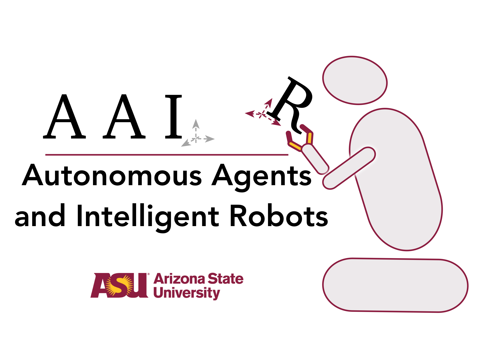

# Public Code Repository of Autonomous Agents and Intelligent Robots Lab, ASU
 
 

### 2021
1. Learning Generalized Relational Heuristic Networks for Model-Agnostic Planning. 
Rushang Karia, Siddharth Srivastava. 
In Proceedings of AAAI, 2021. 

 
 

2. Asking the Right Questions: Learning Interpretable Action Models Through Query Answering. 
Pulkit Verma, Shashank Rao Marpally, Siddharth Srivastava. 
In Proceedings of AAAI, 2021. 

 
 

### 2020

3. Anytime Task and Motion Policies for Stochastic Environments. 
Naman Shah, Deepak Kala Vasudevan, Kislay Kumar, Pranav Kamojhalla, Siddharth Srivastava. 
In Proceedings of ICRA, 2020. 

 
 
