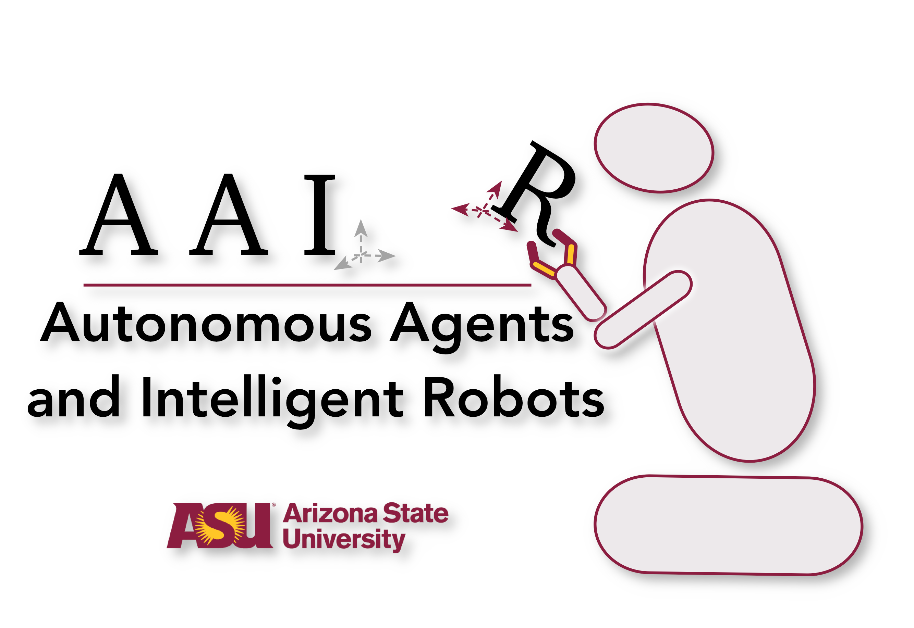

<h1 align="center">Public Code Repository 
<a href="https://aair-lab.github.io">AAIR Lab</a>, ASU </h1>

 
 

### 2021
* JEDAI Explains Decision-making AI. 
<a href="https://github.com/AAIR-lab/AAIR-JEDAI">
  &emsp;&emsp;
</a>
 
 

* Learning Generalized Relational Heuristic Networks for Model-Agnostic Planning. 
Rushang Karia, Siddharth Srivastava. 
In Proceedings of AAAI, 2021. 
<a href="https://github.com/AAIR-lab/GHN">
  &emsp;&emsp;
</a>
 
 

* Asking the Right Questions: Learning Interpretable Action Models Through Query Answering. 
Pulkit Verma, Shashank Rao Marpally, Siddharth Srivastava. 
In Proceedings of AAAI, 2021. 
<a href="https://github.com/AAIR-lab/AIA-AAAI21">
  &emsp;&emsp;
  
</a>
 
 

### 2020

* Anytime Task and Motion Policies for Stochastic Environments. 
Naman Shah, Deepak Kala Vasudevan, Kislay Kumar, Pranav Kamojhalla, Siddharth Srivastava. 
In Proceedings of ICRA, 2020. 
<a href="https://github.com/AAIR-lab/Stochastic-Task-and-Motion-Planning">
  &emsp;&emsp;
</a>
 
 
