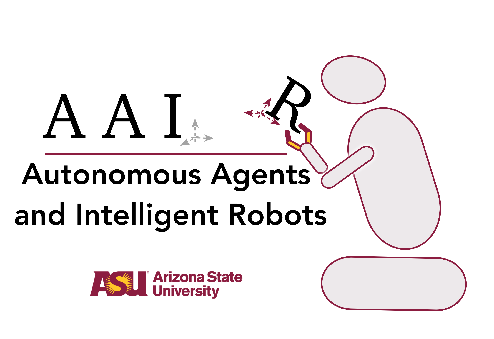

# Autonomous Agents and Intelligent Robots Lab, ASU

 
## Code is available for the following works:

### 2021
1. Learning Generalized Relational Heuristic Networks for Model-Agnostic Planning.
Rushang Karia, Siddharth Srivastava.
In Proceedings of AAAI, 2021.

 
 
 

2. Asking the Right Questions: Learning Interpretable Action Models Through Query Answering.
Pulkit Verma, Shashank Rao Marpally, Siddharth Srivastava.
In Proceedings of AAAI, 2021

 
 
 

### 2020

3. Anytime Task and Motion Policies for Stochastic Environments.
Naman Shah, Deepak Kala Vasudevan, Kislay Kumar, Pranav Kamojhalla, Siddharth Srivastava.
In Proceedings of ICRA, 2020.

 
 
 